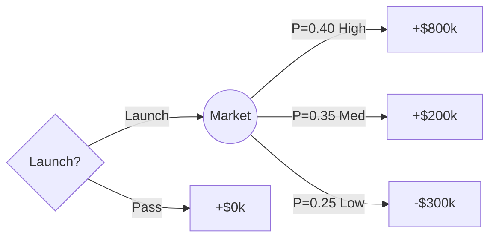

# Decision Tools for Decision Analysis

Curated tools mapped to the three methods in `SKILL.md`: weighted scoring matrix, decision tree, and MCDA. Organised by use case, not vendor preference.

---

## Weighted Decision Matrix

### Spreadsheet (Google Sheets / Excel)

The most practical tool for most teams. No install required.

**Minimal template layout:**

```
      A           B       C         D         E
1  Criterion    Weight  Option A  Option B  Option C
2  Cost         30%     4         2         3
3  Speed        25%     3         5         4
4  Risk         20%     5         3         2
5  Scalability  15%     2         4         5
6  Team fit     10%     4         3         3
7  ─────────────────────────────────────────────
8  Weighted Total  =SUMPRODUCT($B$2:$B$6, C2:C6)
```

Formula for B8 (copy across to D8, E8):
```
=SUMPRODUCT($B$2:$B$6, C2:C6)
```

Weights in column B can be decimals (0.30) or percentages — just be consistent.

**Validation rule**: `=SUM(B2:B6)` must equal 1.0 (or 100%). Add conditional formatting to flag deviations.

**Sensitivity check formula** — to test how much the winner changes:

```
=IF(C8=MAX(C8:E8), "WINNER", "")
```

Change one weight cell and observe which column gains the "WINNER" label.

---

## Decision Tree Calculators

### By Hand (Recommended for ≤ 3 levels)

Standard expected value rollback:

```
EV(node) = Σ [ P(outcome_i) × value(outcome_i) ]
```

For a decision node, choose the branch with the highest EV.

**Worked example — Product Launch Decision:**

```
Launch ──┬── High demand  (P=0.40)  →  +$800k
         ├── Medium demand (P=0.35)  →  +$200k
         └── Low demand   (P=0.25)  →  −$300k

EV(Launch) = 0.40×800 + 0.35×200 + 0.25×(−300)
           = 320 + 70 − 75
           = $315k

Don't launch → $0

Decision: Launch (EV $315k > $0)
```

### Python (stdlib only, no dependencies)

For trees with more branches or when you need to document the logic:

```python
from dataclasses import dataclass
from typing import Optional

@dataclass
class Node:
    label: str
    value: float = 0.0          # terminal payoff
    prob: float = 1.0           # probability of reaching this node from parent
    children: list = None       # list[Node]
    is_decision: bool = False   # True = square (decision), False = circle (chance)

    def ev(self) -> float:
        """Recursive expected value rollback."""
        if not self.children:
            return self.value
        child_evs = [c.prob * c.ev() for c in self.children]
        if self.is_decision:
            return max(child_evs)   # pick best branch
        return sum(child_evs)       # weighted average


# ── Example: same product launch tree ─────────────────────────
launch = Node("Launch", is_decision=False, children=[
    Node("High demand",   value=800, prob=0.40),
    Node("Medium demand", value=200, prob=0.35),
    Node("Low demand",    value=-300, prob=0.25),
])
do_nothing = Node("Do nothing", value=0)

root = Node("Decision", is_decision=True, children=[launch, do_nothing])

print(f"EV(Launch)     = ${launch.ev():.0f}k")
print(f"EV(Do nothing) = ${do_nothing.ev():.0f}k")
print(f"Optimal EV     = ${root.ev():.0f}k")
```

Output:
```
EV(Launch)     = $315k
EV(Do nothing) = $0k
Optimal EV     = $315k
```

### Mermaid (for documentation / async teams)

When you need the tree in a PR, Notion page, or GitHub README:



Mermaid renders natively in GitHub, GitLab, Notion, and Obsidian. It does not calculate EV — pair with a comment showing the hand calculation.

### Dedicated Software

| Tool | Best for | Cost |
|------|----------|------|
| **PrecisionTree** (Palisade) | Full rollback, tornado diagrams, Monte Carlo | Paid |
| **Analytica** | Complex probabilistic models, influence diagrams | Paid |
| **SilverDecisions** | Browser-based, exports JSON, free | Free / open source |
| **TreeAge Pro** | Healthcare / pharma decision models | Paid |

SilverDecisions (`silverDecisions.io`) is the only free tool with proper rollback and sensitivity analysis. Useful for teaching or for decisions complex enough to warrant visual validation.

---

## MCDA Tools

### When to use MCDA vs. a simple weighted matrix

Use MCDA when:
- More than two stakeholders with diverging priorities
- Criteria include qualitative assessments that resist a 1-5 scale
- You need an audit trail showing how weights were derived

For most day-to-day decisions, a weighted matrix (above) is sufficient.

### Analytic Hierarchy Process (AHP) — Pairwise Comparison

AHP derives weights mathematically from pairwise comparisons, removing the need to assign weights directly. Useful when stakeholders cannot agree on raw percentages.

**Step 1 — Build a pairwise comparison matrix**

For 4 criteria (Cost, Speed, Risk, Quality):

```
         Cost  Speed  Risk  Quality
Cost    [ 1    3      5     2     ]
Speed   [ 1/3  1      3     1/2   ]
Risk    [ 1/5  1/3    1     1/4   ]
Quality [ 1/2  2      4     1     ]
```

Entry (i,j) = "How much more important is criterion i compared to j?"
Scale: 1 = equal, 3 = moderately more, 5 = strongly more, 9 = extremely more.
The matrix is always reciprocal: entry (j,i) = 1 / entry (i,j).

**Step 2 — Derive priority weights**

Geometric mean method (easier to compute by hand than eigenvector):

```python
import math

matrix = [
    [1,    3,    5,    2  ],
    [1/3,  1,    3,    1/2],
    [1/5,  1/3,  1,    1/4],
    [1/2,  2,    4,    1  ],
]

n = len(matrix)
geo_means = []
for row in matrix:
    product = 1.0
    for val in row:
        product *= val
    geo_means.append(product ** (1/n))

total = sum(geo_means)
weights = [g / total for g in geo_means]

criteria = ["Cost", "Speed", "Risk", "Quality"]
for c, w in zip(criteria, weights):
    print(f"{c:10s}  {w:.3f}  ({w*100:.1f}%)")
```

Output (approximate):
```
Cost        0.479  (47.9%)
Speed       0.222  (22.2%)
Risk        0.081  ( 8.1%)
Quality     0.218  (21.8%)
```

**Step 3 — Consistency check**

AHP requires a Consistency Ratio (CR) ≤ 0.10. If CR > 0.10, the pairwise judgements are contradictory and need revision.

```python
# Compute lambda_max (principal eigenvalue approximation)
weighted_sums = []
for j in range(n):
    col_sum = sum(matrix[i][j] for i in range(n))
    weighted_sums.append(col_sum * weights[j])

lambda_max = sum(weighted_sums)

# Consistency Index
CI = (lambda_max - n) / (n - 1)

# Random Index (Saaty's table)
RI_table = {1: 0.00, 2: 0.00, 3: 0.58, 4: 0.90,
            5: 1.12, 6: 1.24, 7: 1.32, 8: 1.41}
RI = RI_table[n]

CR = CI / RI
print(f"CR = {CR:.3f}  ({'OK' if CR <= 0.10 else 'INCONSISTENT — revise judgements'})")
```

### Free MCDA Tools

| Tool | Method | Notes |
|------|--------|-------|
| **BPMSG AHP Online** | AHP | Browser, exports weights, free |
| **D-Sight** | Weighted sum + ELECTRE | Free tier available |
| **1000minds** | PAPRIKA (pairwise) | Strong for group decisions, free tier |
| **Limesurvey + manual aggregation** | Any | For collecting stakeholder weights via survey |

---

## Risk-Adjusted Decision Tools

EV alone ignores risk preference (stated as a Gotcha in `SKILL.md`). Two lightweight adjustments:

### 1. Certainty Equivalent

Ask: "What guaranteed amount would you accept instead of this gamble?"

```
CE < EV  → risk-averse
CE = EV  → risk-neutral
CE > EV  → risk-seeking
```

In the launch example: EV = $315k. If the team says "we'd accept $200k guaranteed", their CE = $200k. The risk premium = $315k − $200k = $115k. That $115k represents the cost of bearing uncertainty.

### 2. Expected Utility (Exponential Utility Function)

For financial decisions where loss aversion matters:

```
U(x) = 1 − e^(−x/R)
```

Where R = risk tolerance (the amount where U(x) ≈ 0.632, roughly "comfortable loss threshold").

```python
import math

def utility(payoff, R):
    return 1 - math.exp(-payoff / R)

def expected_utility(outcomes, R):
    # outcomes: list of (probability, payoff) tuples
    return sum(p * utility(v, R) for p, v in outcomes)

R = 500  # team can absorb ~$500k loss without existential risk

launch_outcomes = [(0.40, 800), (0.35, 200), (0.25, -300)]
eu_launch = expected_utility(launch_outcomes, R)
eu_pass   = utility(0, R)

print(f"EU(Launch) = {eu_launch:.3f}")
print(f"EU(Pass)   = {eu_pass:.3f}")
```

If `eu_launch < eu_pass`, a risk-averse team rationally prefers not to launch despite positive EV. This formalises what "EV ignores risk preference" means in practice.

---

## Choosing the Right Tool

```
Decision complexity
        │
        ├── Single decision, ≤ 6 options, 1-2 stakeholders
        │       └── Weighted matrix in Google Sheets
        │
        ├── Sequential decisions or explicit uncertainty
        │       ├── ≤ 3 levels           → hand calculation + Mermaid diagram
        │       └── > 3 levels or Monte  → SilverDecisions or Python script
        │
        ├── Multiple stakeholders, diverging priorities
        │       ├── Can agree on weights → Weighted matrix (per stakeholder, then aggregate)
        │       └── Cannot agree         → AHP pairwise (BPMSG or 1000minds)
        │
        └── High stakes + risk aversion matters
                └── Expected Utility (exponential) or Certainty Equivalent elicitation
```

---

## Iron Law Reminder

These tools make it easy to reverse-engineer weights after seeing scores — especially in spreadsheets where you can just drag a slider. That is exactly what the IRON LAW prohibits. Lock criteria and weights in a separate tab (or commit) before entering option scores. In group settings, collect weights from each stakeholder independently (via 1000minds or a survey) before anyone sees the aggregated scores.
