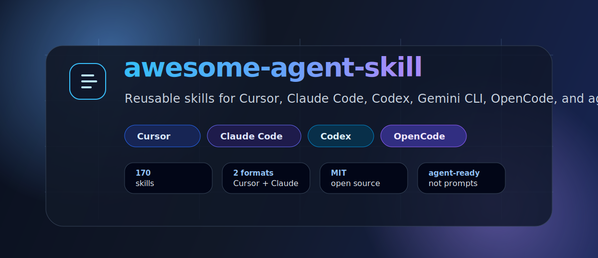

<div align="center">



<br />

[](https://github.com/charlieviettq/awesome-agent-skill/stargazers)
[](LICENSE)
[](.cursor/skills)
[](https://charlieviettq.github.io/awesome-agent-skill/)
[](#quickstart)
[](https://awesome.re)
[](https://github.com/charlieviettq/awesome-agent-skill/commits/main)
[](https://github.com/charlieviettq/awesome-agent-skill/graphs/contributors)

**A curated, open-source skill library for agentic developer tools.**

Give your coding agent reusable playbooks for planning, debugging, QA, security, docs, data work, browser automation, and shipping.

**[Open Skill Marketplace](https://charlieviettq.github.io/awesome-agent-skill/)** — search 178 skills, preview `SKILL.md` inline, explore the bundle graph, copy install commands.

</div>

---

## Why This Exists

Most agents start every task from a blank prompt. Skills give them reusable operating procedures: when to ask for clarification, how to run a review, how to triage tests, how to handle PDFs, how to build a quick analysis, how to use browser QA, and how to ship safely.

`awesome-agent-skill` packages those workflows as portable `SKILL.md` files for modern coding agents.

## Skill Marketplace

Live demo: **[charlieviettq.github.io/awesome-agent-skill](https://charlieviettq.github.io/awesome-agent-skill/)**

| Feature | What you get |
|---------|----------------|
| Task advisor | Describe your task, get skills + bundle + install command |
| Browse & filter | Domain, tier, risk, quality, bundle filters |
| Bundle graph | Interactive force graph of bundle → domain → skill |
| Skill preview | Read `SKILL.md` on the page without opening GitHub |

Regenerate locally: `python3 scripts/generate-catalog.py` then serve `catalog/`.

## What You Get

| Area | Includes |
|------|----------|
| Agent workflow | Specs, planning, TDD, incremental implementation, code review, verification |
| Agent systems | MCP, RAG, tool contracts, context-window management, agent evaluation |
| Browser QA | gstack-style browsing, QA, canary checks, benchmarks, screenshots |
| Reliability and security | CI gates, launch checklists, observability, API security, skill supply-chain audit |
| Data and content | Analysis, visualization, documents, spreadsheets, PDFs, presentations |
| Role playbooks | Engineering, research, product, operations, orchestration, language experts |

## Works With

Portable `SKILL.md` folders for agentic coding tools:

| Tool | Install path | Notes |
|------|--------------|-------|
| [Cursor](https://cursor.com) | `.cursor/skills/` | Source of truth in this repo |
| [Claude Code](https://docs.anthropic.com/en/docs/claude-code) | `.claude/skills/` | Generated from Cursor skills |
| [Codex CLI](https://github.com/openai/codex) | `.claude/skills/` or project skills dir | Copy compatible skill folders |
| [OpenCode](https://github.com/opencode-ai/opencode) | `.opencode/skills/` or `.cursor/skills/` | Follow your client’s skill discovery path |
| Gemini CLI / other agents | Project skills directory | Same `SKILL.md` format; verify client docs |

Copy only the domains you need. Reload the agent session after installing skills.

## Compatibility Matrix

| Tool | Install path | Reload required | Commands support |
|------|--------------|-----------------|------------------|
| Cursor | `.cursor/skills/` | Reload window / new chat | Project rules optional |
| Claude Code | `.claude/skills/` | Restart session | Optional `.claude/commands/` |
| Codex CLI | project skills dir | Restart session | Follow client docs |
| OpenCode | `.opencode/skills/` or `.cursor/skills/` | Restart session | Follow client docs |
| Gemini CLI | `.gemini/commands/` + skills dir | Restart session | Optional `.gemini/commands/` |

Skills remain the source of truth. Commands in `.claude/commands/` and `.gemini/commands/` are optional wrappers for validate/sync/install workflows.

## Quickstart (3 steps)

**1. Choose a bundle** — browse the [Skill Marketplace](https://charlieviettq.github.io/awesome-agent-skill/) or ask the advisor:

```bash
git clone https://github.com/charlieviettq/awesome-agent-skill.git
cd awesome-agent-skill
python3 scripts/skillhub.py recommend "ship safely with tests and CI"
```

**2. Install** into your project (preview first with `--dry-run`):

```bash
python3 scripts/skillhub.py install-bundle ship-ready /path/to/project --format cursor --dry-run
python3 scripts/skillhub.py install-bundle ship-ready /path/to/project --format cursor
```

Or install the CLI package: `pip install -e .` then `skillhub install-bundle starter . --format cursor`.

**3. Reload** your agent (Cursor: reload window / new chat; Claude Code: restart session).

### More install options

```bash
# Curated bundles (see registry/bundles.json)
bash scripts/install/install-bundle.sh starter /path/to/project --format both
bash scripts/install/install-bundle.sh agent-builder /path/to/project --format cursor

# Single domain or skill
bash scripts/install/install-domain.sh core-workflow /path/to/project --format cursor
bash scripts/install/install-skill.sh core-workflow/verify-before-done /path/to/project --format cursor
```

See [docs/skillhub-cli.md](docs/skillhub-cli.md) and [docs/comparison.md](docs/comparison.md) (how this differs from a plain awesome list).

**Marketplace:** `python3 scripts/generate-catalog.py` — deployed via GitHub Pages from `catalog/`.

Manual install (Cursor):

```bash
mkdir -p /path/to/project/.cursor/skills
rsync -a .cursor/skills/core-workflow/ /path/to/project/.cursor/skills/core-workflow/
rsync -a .cursor/skills/security-appsec/ /path/to/project/.cursor/skills/security-appsec/
rsync -a .cursor/skills/writing-docs/ /path/to/project/.cursor/skills/writing-docs/
```

Install Claude Code skills:

```bash
mkdir -p /path/to/project/.claude/skills
rsync -a .claude/skills/ /path/to/project/.claude/skills/
```

Reload your agent session after copying skills.

## Optional Commands

Optional slash-command wrappers (skills remain source of truth):

| Command | Claude Code | Gemini CLI |
|---------|-------------|------------|
| Validate skills | `/validate-skills` | `validate-skills` |
| Sync Claude output | `/sync-skills` | `sync-skills` |
| Install domain | `/install-domain` | copy from `scripts/install/` |
| Install bundle | `/install-bundle` | copy from `scripts/install/` |

Copy `.claude/commands/` or `.gemini/commands/` into your project to enable.

## Formats

| Agent surface | Path | Status |
|---------------|------|--------|
| Cursor | `.cursor/skills/**/SKILL.md` | Source of truth |
| Claude Code | `.claude/skills/**/SKILL.md` | Generated and committed |

Regenerate Claude-format skills after editing Cursor-format skills:

```bash
python3 scripts/convert-to-claude.py --in-repo --force --write-map
```

## Skill Map


Full index: [`SKILL_INVENTORY.md`](SKILL_INVENTORY.md)

## Repository Layout

```text
.
├── .cursor/skills/      # Cursor skill format, source of truth
├── .claude/skills/      # Claude Code skill format, generated from Cursor skills
├── .claude/commands/    # Optional Claude slash commands
├── .gemini/commands/    # Optional Gemini command wrappers
├── scripts/             # Conversion, validation, install, metrics
├── docs/                # Contributor guides, distribution, release cadence
├── .github/workflows/   # Skill validation CI
└── SKILL_INVENTORY.md   # Human-readable skill index
```

## Highlights

| Folder | Good For |
|--------|----------|
| `core-workflow/` | Spec-first implementation, planning, TDD, verification, reviews |
| `ai-agent-systems/` | MCP servers, RAG systems, agent evals, tool schemas |
| `gstack/` | Browser QA, ship workflows, design review, scrape flows |
| `voltagent/` | Role-based subagent playbooks |
| `security-appsec/` | API security, secure design, skill supply-chain checks |
| `reliability-ops/` | CI gates, SLOs, launch readiness, postmortems |
| `writing-docs/` | PDF, DOCX, XLSX, PPTX, prose polish |
| `visualization/` | Charts, figures, infographics, data storytelling |

## Design Principles

- **Portable:** skills are plain folders with `SKILL.md`.
- **Composable:** copy one domain or the full pack.
- **Public-safe:** no secrets, customer data, or private org assumptions.
- **Agent-first:** written as workflows an agent can follow, not as static articles.
- **Reviewable:** skills stay small; long references belong in `reference.md` or examples.

## Updating Skills

Edit the Cursor source:

```bash
$EDITOR .cursor/skills/core-workflow/spec-driven-development/SKILL.md
```

Regenerate Claude output:

```bash
python3 scripts/convert-to-claude.py --in-repo --force --write-map
```

Run validation:

```bash
python3 scripts/validate-skills.py
```

Generate metrics snapshot:

```bash
python3 scripts/repo-metrics.py
```

## Private Skills

Keep team-specific or sensitive skills in your own repository under paths such as `.cursor/skills/private/` and `.claude/skills/private/`. This public pack is intentionally generic.

## Contributing

Contributions welcome. See [`.github/CONTRIBUTING.md`](.github/CONTRIBUTING.md), [`docs/skill-writing-guide.md`](docs/skill-writing-guide.md), and [`docs/review-rubric.md`](docs/review-rubric.md).

- Propose a skill: [New skill issue](https://github.com/charlieviettq/awesome-agent-skill/issues/new?template=new-skill.yml)
- Report outdated content: [Outdated skill issue](https://github.com/charlieviettq/awesome-agent-skill/issues/new?template=outdated-skill.yml)
- Track awesome-list submission: [Distribution issue](https://github.com/charlieviettq/awesome-agent-skill/issues/new?template=awesome-list-submission.yml)
- Good first issues: [`docs/good-first-issues.md`](docs/good-first-issues.md)

Recent changes: [`CHANGELOG.md`](CHANGELOG.md) | Release cadence: [`docs/RELEASE_CADENCE.md`](docs/RELEASE_CADENCE.md)

## Submit to Awesome Lists

If you maintain an awesome-list or agent-tools roundup, consider linking this repo under categories such as **AI agents**, **Cursor**, **Claude Code**, **MCP**, or **developer tools**. Suggested blurb:

> **awesome-agent-skill** — 170+ portable agent skills (planning, QA, security, MCP, browser automation, data/docs) for Cursor and Claude Code.

External catalogs we track: [`EXTERNAL_SKILLS.md`](EXTERNAL_SKILLS.md) | Submission tracker: [`docs/distribution.md`](docs/distribution.md)

## License

MIT. See [LICENSE](LICENSE). Use it, fork it, and adapt it for your own agents.

